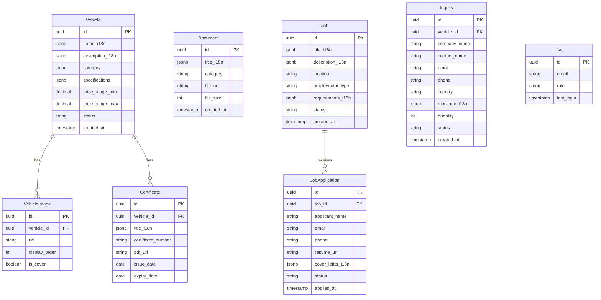

## 产品概述

将现有汽车外贸B2B独立站从MongoDB架构迁移至Supabase+R2+SMTP现代化技术栈，实现生产级MVP版本。系统支持4种语言（英语/阿拉伯语/西班牙语/中文），面向海外B2B客户提供整车展示、证书查询、文档管理、招聘系统和询盘系统。初期通过手动录入20-30款车型数据完成产品验证。

## 核心功能

- **整车展示系统**: 多语言车型库浏览、详情页、规格参数展示、高清图片画廊
- **证书查询系统**: 车辆认证证书管理、在线查询验证、PDF文档下载
- **文档管理系统**: 产品手册、技术文档、合同模板的分类管理和下载
- **招聘系统**: 职位发布、在线申请、简历管理、候选人跟踪
- **询盘系统**: B2B询价表单、邮件通知、询盘记录管理、客户跟进
- **后台管理**: 数据录入、内容审核、用户权限、系统配置

## 技术栈

### 前端架构

- **框架**: Next.js 14 (App Router) + TypeScript
- **样式**: Tailwind CSS + shadcn/ui 组件库
- **状态管理**: React Server Components + Client Components混合架构
- **国际化**: next-intl（支持英/阿拉伯/西班牙/中文）
- **表单处理**: React Hook Form + Zod验证

### 后端架构

- **数据库**: Supabase PostgreSQL（内置Row Level Security）
- **认证**: Supabase Auth（邮箱/密码登录，支持角色管理）
- **API层**: Next.js API Routes + Supabase Client
- **文件存储**: Cloudflare R2（图片、PDF、简历等文件）
- **邮件服务**: Nodemailer + Gmail/Outlook SMTP

### 部署方案

- **托管平台**: Vercel（前端+API Routes）
- **数据库**: Supabase Cloud（免费套餐支持500MB）
- **存储**: Cloudflare R2（每月10GB免费额度）
- **CDN**: Cloudflare（全球加速）

## 系统架构

### 整体架构设计


### 数据模型设计



### 模块划分

#### 1. 前台展示模块（公开访问）

- **技术**: Next.js Server Components + ISR增量静态生成
- **核心页面**: 首页、车型列表、车型详情、证书查询、文档中心、招聘页、询盘表单
- **依赖**: Supabase匿名查询（RLS公开读取策略）、R2公开资源访问
- **接口**: `GET /api/vehicles`, `GET /api/certificates`, `GET /api/documents`, `GET /api/jobs`

#### 2. 询盘处理模块

- **技术**: Next.js API Routes + Nodemailer
- **功能**: 表单提交、数据验证、邮件发送、CRM记录
- **依赖**: Supabase写入、SMTP服务
- **接口**: `POST /api/inquiries`

#### 3. 招聘申请模块

- **技术**: Next.js API Routes + R2 Upload
- **功能**: 简历上传、申请提交、邮件通知
- **依赖**: Cloudflare R2、Supabase、SMTP
- **接口**: `POST /api/applications`, `POST /api/upload/resume`

#### 4. 后台管理模块（需认证）

- **技术**: Next.js Client Components + Supabase Auth
- **功能**: 数据CRUD、文件上传、权限控制
- **依赖**: Supabase RLS认证策略、R2私有上传
- **接口**: `POST /api/admin/*`

#### 5. 文件存储模块

- **技术**: Cloudflare R2 + 预签名URL
- **目录结构**: 
- `/vehicles/{id}/images/*` - 车辆图片
- `/certificates/{id}/*.pdf` - 证书文件
- `/documents/{category}/*` - 文档文件
- `/resumes/{application_id}/*` - 简历文件

### 数据流设计


## 实施细节

### 核心代码结构

```
auto-export-mvp/
├── app/
│   ├── [locale]/                    # 国际化路由
│   │   ├── page.tsx                 # 首页
│   │   ├── vehicles/                # 车型模块
│   │   │   ├── page.tsx            # 列表页
│   │   │   └── [id]/page.tsx       # 详情页
│   │   ├── certificates/            # 证书查询
│   │   ├── documents/               # 文档中心
│   │   ├── careers/                 # 招聘系统
│   │   ├── inquiry/                 # 询盘表单
│   │   └── admin/                   # 后台管理
│   └── api/
│       ├── vehicles/                # 车型API
│       ├── inquiries/               # 询盘API
│       ├── applications/            # 申请API
│       └── upload/                  # 文件上传API
├── lib/
│   ├── supabase/
│   │   ├── client.ts               # Supabase客户端
│   │   ├── server.ts               # 服务端客户端
│   │   └── types.ts                # 数据库类型
│   ├── r2/
│   │   └── upload.ts               # R2上传工具
│   └── email/
│       └── mailer.ts               # 邮件发送
├── components/
│   ├── vehicle/                     # 车型组件
│   ├── forms/                       # 表单组件
│   └── admin/                       # 后台组件
└── messages/                        # 国际化文案
    ├── en.json
    ├── ar.json
    ├── es.json
    └── zh.json
```

### 关键实现方案

#### 1. Supabase数据库设计

```sql
-- 车辆表（使用JSONB存储多语言）
CREATE TABLE vehicles (
  id UUID PRIMARY KEY DEFAULT uuid_generate_v4(),
  name_i18n JSONB NOT NULL,
  description_i18n JSONB,
  category VARCHAR(50),
  specifications JSONB,
  price_range_min DECIMAL(10,2),
  price_range_max DECIMAL(10,2),
  status VARCHAR(20) DEFAULT 'active',
  created_at TIMESTAMP DEFAULT NOW()
);

-- RLS策略：公开读取，仅管理员写入
ALTER TABLE vehicles ENABLE ROW LEVEL SECURITY;
CREATE POLICY "公开读取" ON vehicles FOR SELECT USING (true);
CREATE POLICY "管理员写入" ON vehicles FOR ALL USING (auth.jwt()->>'role' = 'admin');
```

#### 2. R2文件上传流程

```typescript
// 1. 客户端上传请求
// 2. 后端生成预签名URL
// 3. 客户端直接上传到R2
// 4. 上传成功后保存URL到Supabase
```

#### 3. 多语言数据处理

```typescript
interface I18nField {
  en: string;
  ar: string;
  es: string;
  zh: string;
}

// 数据库存储格式
{
  "name_i18n": {
    "en": "Toyota Land Cruiser",
    "ar": "تويوتا لاند كروزر",
    "es": "Toyota Land Cruiser",
    "zh": "丰田兰德酷路泽"
  }
}
```

### 性能优化策略

1. **ISR增量静态生成**: 车型列表和详情页使用`revalidate: 3600`（1小时）
2. **图片优化**: Next.js Image组件 + R2自动WebP转换
3. **数据库索引**: vehicle_id、category、status字段建立索引
4. **CDN缓存**: 静态资源通过Cloudflare CDN加速
5. **分页查询**: 列表页默认每页20条，支持懒加载

### 安全措施

1. **认证**: Supabase Auth邮箱验证 + JWT令牌
2. **授权**: RLS策略区分公开/管理员权限
3. **输入验证**: Zod schema验证所有表单输入
4. **文件上传**: 限制文件类型（图片/PDF）和大小（10MB）
5. **SQL注入防护**: 使用Supabase参数化查询
6. **XSS防护**: React自动转义 + CSP策略

### 开发工作流

1. **本地开发**: 使用Supabase本地实例 + R2测试桶
2. **数据迁移**: 编写脚本从MongoDB导出JSON → 转换为SQL → 导入Supabase
3. **测试策略**: 单元测试（组件）+ 集成测试（API）+ E2E测试（关键流程）
4. **部署流程**: Git推送 → Vercel自动构建 → 生产环境发布

## 设计风格

采用现代B2B企业级设计风格，融合汽车行业专业感与国际化外贸平台的信任感。使用深色主色调配合金属质感，营造高端稳重的品牌形象。页面布局遵循F型视觉动线，强调产品展示与转化路径。

## 页面规划

### 1. 首页（Home）

- **Hero区块**: 全屏视频背景展示车辆行驶场景，叠加渐变蒙版，中央放置多语言标语和CTA按钮（"浏览车型"/"立即询价"）
- **产品分类导航**: 横向卡片式分类展示（轿车/SUV/皮卡/商用车），悬停效果显示分类图片
- **精选车型**: 3列栅格布局展示热门车型，卡片包含封面图、车型名称、价格区间、快速询价按钮
- **企业优势**: 4个图标+数字的统计模块（出口国家数/服务客户数/车型库存/认证证书）
- **底部导航**: 深色背景，包含公司信息、快速链接、联系方式、语言切换器

### 2. 车型列表页（Vehicles）

- **顶部筛选栏**: 固定吸顶，包含分类、价格区间、搜索框，使用shadcn Select和Slider组件
- **车型卡片**: 2列响应式布局，每张卡片显示封面图、名称、核心参数（排量/座位数/驱动方式）、价格、"查看详情"按钮
- **侧边栏**: 固定左侧，展示激活的筛选条件和重置按钮
- **分页器**: 底部居中，使用shadcn Pagination组件

### 3. 车型详情页（Vehicle Detail）

- **图片画廊**: 左侧大图+底部缩略图轮播，支持全屏预览，使用shadcn Carousel
- **基本信息**: 右侧面板显示车型名称、价格区间、在线状态标签、分享按钮
- **Tab切换区**: 包含"技术规格"/"认证证书"/"相关文档"三个标签页
- **询价表单**: 页面底部固定悬浮框，包含快速询价按钮，点击展开完整表单（使用shadcn Dialog）
- **相关推荐**: 底部展示同类车型横向滚动列表

### 4. 证书查询页（Certificates）

- **搜索区块**: 顶部居中，输入证书编号或车型名称，使用shadcn Command组件实现模糊搜索
- **证书列表**: 表格形式展示，包含证书名称、车型、颁发日期、有效期、"查看PDF"操作按钮
- **PDF预览**: 点击后使用shadcn Sheet侧边栏展示PDF嵌入查看器

### 5. 招聘页（Careers）

- **职位列表**: 卡片式布局，每张卡片显示职位标题、地点、类型（全职/兼职）、发布日期
- **申请表单**: 使用shadcn Dialog模态框，包含上传简历（Dropzone）、填写基本信息、提交按钮
- **进度提示**: 使用shadcn Toast显示提交成功/失败通知

### 6. 后台管理（Admin Dashboard）

- **侧边菜单**: 固定左侧深色菜单栏，包含车型管理/证书管理/文档管理/招聘管理/询盘管理
- **数据表格**: 使用shadcn Data Table展示列表数据，支持排序、筛选、分页
- **编辑表单**: 使用shadcn Sheet侧边栏或Dialog模态框，包含多语言输入框、文件上传、富文本编辑器
- **状态指示**: 使用shadcn Badge显示数据状态（草稿/已发布/已归档）

## 代理扩展

### SubAgent

- **code-explorer**
- 用途：分析现有Next.js项目的目录结构、依赖关系和代码模式，识别MongoDB相关代码位置
- 预期结果：生成完整的代码地图，标记需要迁移的数据模型文件、API路由和数据库连接配置