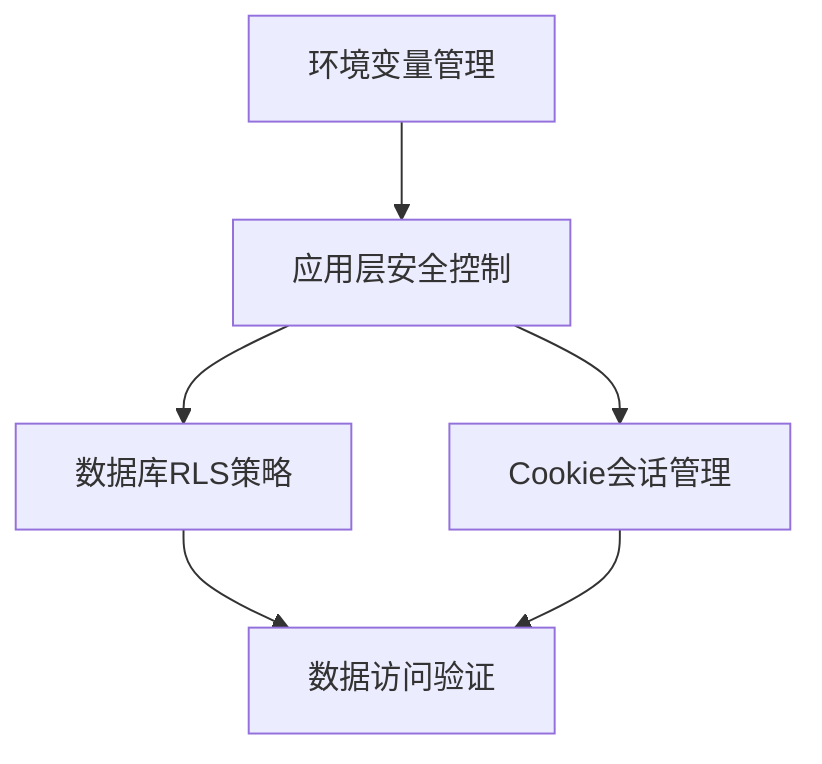
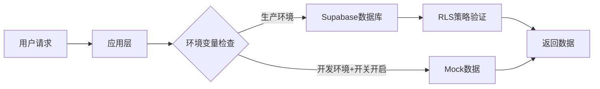

## 产品概述

针对现有项目进行安全加固和优化，解决高风险安全问题，清理Mock数据，增强Cookie安全性，并添加环境变量开关控制生产环境行为。

## 核心功能

- 防止环境变量泄漏到版本控制系统
- 通过环境变量控制Mock数据的fallback机制
- 验证并增强Supabase RLS安全策略
- 强化会话Cookie的安全配置
- 清理生产环境中的Mock数据依赖

## 技术栈

- 框架: Next.js (TypeScript)
- 数据库: Supabase (PostgreSQL + RLS)
- 认证: Cookie-based Session
- 环境管理: dotenv

## 架构设计

### 系统架构

采用分层安全防护架构，从环境配置、数据访问、到会话管理进行全方位加固。



### 模块划分

#### 环境配置模块

- 职责: 管理敏感配置信息，防止泄漏
- 技术: .gitignore, .env.local, 环境变量验证
- 依赖: Next.js 环境变量系统
- 接口: process.env.ENABLE_FALLBACK, process.env.ADMIN_PASSWORD

#### 数据访问控制模块

- 职责: 控制Mock数据使用，验证RLS策略
- 技术: Supabase Client, RLS Policies
- 依赖: 环境配置模块
- 接口: getVehicles(), getRentalPrices()

#### 会话安全模块

- 职责: 管理安全的用户会话
- 技术: HTTP-only Cookies, Secure flags
- 依赖: Next.js API Routes
- 接口: /api/admin/login

### 数据流



## 实现细节

### 核心目录结构

```
project-root/
├── .gitignore              # 版本控制忽略规则
├── .env.local.example      # 环境变量模板
├── app/
│   ├── [locale]/
│   │   └── page.tsx       # 首页组件（需清理Mock）
│   └── api/
│       └── admin/
│           └── login/
│               └── route.ts # 登录API（需加强Cookie安全）
└── lib/
    └── supabase/
        └── client.ts       # Supabase客户端配置
```

### 关键代码结构

#### 环境变量配置

```typescript
// .env.local.example
NEXT_PUBLIC_SUPABASE_URL=your_supabase_url
NEXT_PUBLIC_SUPABASE_ANON_KEY=your_anon_key
ADMIN_PASSWORD=your_secure_password
ENABLE_FALLBACK=false  # 生产环境必须为false
```

#### Cookie安全配置

```typescript
// app/api/admin/login/route.ts
const cookieOptions = {
  httpOnly: true,
  secure: process.env.NODE_ENV === 'production',
  sameSite: 'strict' as const,
  maxAge: 60 * 60 * 24 * 7,
  path: '/'
};
```

#### 环境变量控制的数据获取

```typescript
const shouldUseFallback = 
  process.env.NODE_ENV !== 'production' && 
  process.env.ENABLE_FALLBACK === 'true';

const vehicles = shouldUseFallback 
  ? fallbackVehicles 
  : await fetchFromSupabase();
```

### 技术实现计划

#### 1. 环境变量安全

- 问题: 敏感配置可能泄漏到Git仓库
- 解决方案: 完善.gitignore，更新.env.local.example
- 关键技术: Git版本控制配置
- 实施步骤:

1. 检查并更新.gitignore确保包含.env*.local
2. 在.env.local.example中添加所有必需变量
3. 添加ENABLE_FALLBACK环境变量示例
4. 验证敏感文件未被跟踪

- 潜在挑战: 已有.env.local可能已被提交到仓库

#### 2. Mock数据清理

- 问题: 生产环境仍可能使用Mock数据
- 解决方案: 添加环境变量开关严格控制
- 关键技术: 环境变量条件判断
- 实施步骤:

1. 添加ENABLE_FALLBACK环境变量
2. 在page.tsx中添加条件判断逻辑
3. 确保生产环境默认禁用fallback
4. 添加开发环境提示日志

- 潜在挑战: 需确保所有使用Mock数据的地方都受控

#### 3. RLS策略验证

- 问题: 数据库行级安全可能未正确配置
- 解决方案: 验证并记录RLS策略状态
- 关键技术: Supabase RLS Policies
- 实施步骤:

1. 检查vehicles和rental_prices表的RLS状态
2. 验证现有策略的正确性
3. 在应用层添加权限验证
4. 创建RLS验证文档

- 潜在挑战: 需要数据库管理权限进行策略检查

#### 4. Cookie安全加固

- 问题: Cookie缺少完整的安全标志
- 解决方案: 添加httpOnly, secure, sameSite标志
- 关键技术: Next.js Cookie配置
- 实施步骤:

1. 更新login route.ts的Cookie设置
2. 添加secure标志（仅生产环境）
3. 设置sameSite为strict
4. 验证Cookie在浏览器中的表现

- 潜在挑战: 需要HTTPS环境测试secure标志

### 集成点

- 环境变量系统与应用逻辑集成
- Supabase客户端与RLS策略集成
- Next.js API Routes与Cookie管理集成

## 技术考量

### 安全措施

- 使用.gitignore防止敏感文件提交
- 环境变量验证确保生产配置正确
- RLS双重验证（数据库+应用层）
- Cookie使用httpOnly防止XSS攻击
- sameSite防止CSRF攻击

### 开发工作流

- 开发环境: 使用.env.local配置
- 生产环境: 使用平台环境变量
- Mock数据: 仅在ENABLE_FALLBACK=true时启用
- 安全审计: 定期检查.gitignore和环境变量

## Agent Extensions

### SubAgent

- **code-explorer**
- 目的: 搜索项目中所有使用Mock数据和环境变量的文件位置
- 预期结果: 找到所有需要添加环境变量控制的代码位置，包括fallbackVehicles、fallbackRentalPrices等Mock数据的使用点